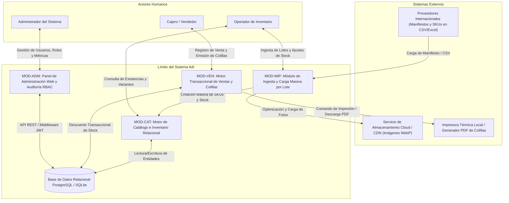

# 01. Diagrama de Contexto del Sistema

### 1. Metadatos del Documento
**Proyecto:** Adí (Gestión de Inventario y CRM de Calzado Deportivo)  
**Fase:** 3 — Ingeniería de Requisitos  
**Entregable:** 1 de 12 (D1 — Diagrama de Contexto del Sistema)  
**Estado:** Aprobado  

---

### 2. Definición de Límites del Sistema

El **Sistema Adí** (`adi-inventory-crm`) es una plataforma centralizada de gestión de inventario relacional y registro transaccional de ventas desacoplada, enfocada en la comercialización de calzado deportivo. El sistema opera entre las fuentes primarias de mercancía importada (lotes de proveedores internacionales) y los puntos de interacción operativa y comercial (registro transaccional y emisión de colillas/comprobantes físicos y digitales).

### 3. Diagrama de Contexto del Sistema (Mermaid)

### 4. Catálogo de Interfaces Externas

1. **Interfaz de Ingesta por Lote (Proveedores):** Recibe manifiestos de carga en CSV o JSON con información de proveedor internacional, marca, modelo, SKUs, colorways y desgloses de tallas (US/EU/COL).
2. **Interfaz de Almacenamiento CDN/Cloud:** Servicio de carga asíncrona que comprime imágenes de calzado al formato WebP optimizado y retorna URLs públicas para su renderizado en el gestor.
3. **Interfaz de Impresión / Salida de Colillas:** Servicio local que genera archivos PDF y comanda impresoras térmicas (POS) para la emisión de comprobantes físicos de compra con código de barras/QR.
4. **Persistencia Relacional ACID:** Conexión con PostgreSQL o SQLite para garantizar 0 descuadres en el inventario relacional al procesar ventas concurrentes.
