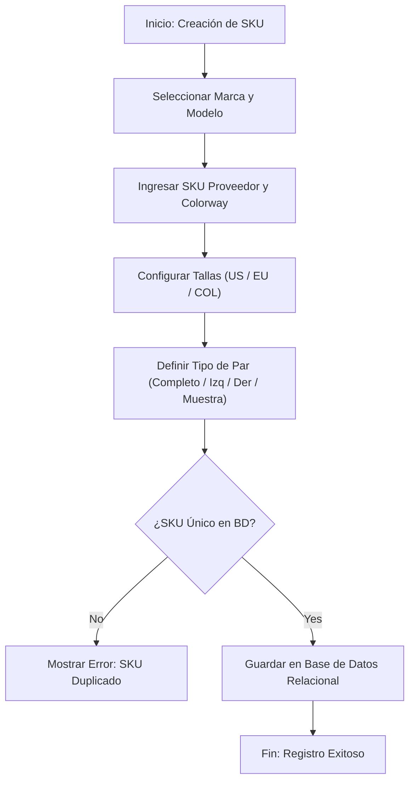

# Especificación de Módulo: MOD-CAT (Gestión de Catálogo e Inventario Relacional)

### 1. Metadatos del Documento
- **Proyecto:** Adí (Gestión de Inventario y CRM de Calzado Deportivo)
- **Fase:** 3 — Ingeniería de Requisitos
- **Entregable:** Capa 2 — Especificación de Módulo (1 de 4)
- **Módulo:** `MOD-CAT` (Gestión de Catálogo, SKUs, Tallas, Colores, Tipos de Par y Stock)
- **Estado:** Aprobado / Cierre Provisional

---

### 2. Requisitos Base

#### 2.1 Requisitos Funcionales (FR)
- **[CR-CAT-01]** El sistema debe permitir la creación, edición y eliminación lógica de entidades de Marca (ej. Nike, Adidas, Puma) y Modelo (ej. Air Force 1, Ultraboost).
- **[CR-CAT-02]** El sistema debe gestionar el registro de SKUs de Proveedor Internacional con su correspondiente combinación de Colorway.
- **[CR-CAT-03]** El sistema debe soportar una matriz tridimensional de tallas permitiendo la equivalencia cruzada entre marcas (US, EU, COL).
- **[CR-CAT-04]** El sistema debe permitir parametrizar la variante por **Tipo de Par** (Par Completo, Pie Izquierdo, Pie Derecho, Muestra/Exhibición).
- **[CR-CAT-05]** El sistema debe mantener el recuento en tiempo real de unidades físicas disponibles por SKU, talla, color y tipo de par.
- **[CR-CAT-06]** El sistema debe emitir alertas visuales automáticas cuando el stock de una variante caiga por debajo del umbral de stock mínimo parametrizado.

#### 2.2 Requisitos No Funcionales del Módulo (NFR)
- **[NFR-CAT-01] Rendimiento de Consulta:** La búsqueda y filtrado de catálogo por SKU, marca, modelo o talla debe responder en < 100 ms.
- **[NFR-CAT-02] Integridad Referencial:** Ninguna variante de calzado puede quedar huérfana de su modelo o marca asociada en la base de datos relacional.

---

### 3. Historias de Usuario (User Stories)

| ID | Como [Actor] | Quiero [Acción] | Para [Valor] | Origen FR |
| --- | --- | --- | --- | --- |
| **US-CAT-01** | Operador de Inventario | Registrar un nuevo modelo de zapatilla asociándole su marca y colorway. | Organizar el catálogo de forma relacional y estructurada. | CR-CAT-01, CR-CAT-02 |
| **US-CAT-02** | Operador de Inventario | Especificar si un ingreso de mercancía corresponde a un Par Completo, Pie Izquierdo o Pie Derecho. | Controlar con precisión las existencias físicas en bodega. | CR-CAT-04 |
| **US-CAT-03** | Cajero / Vendedor | Consultar la equivalencia de talla de un calzado en sistemas US, EU y COL. | Responder rápidamente al cliente en el punto de venta. | CR-CAT-03 |
| **US-CAT-04** | Operador de Inventario | Recibir una alerta en pantalla cuando un modelo alcance el stock mínimo de existencias. | Gestionar el reabastecimiento oportuno con el proveedor. | CR-CAT-06 |

---

### 4. Casos de Uso (Use Cases)

#### UC-CAT-01: Registro de Nuevo SKU con Variantes de Talla y Tipo de Par
- **Actor:** Operador de Inventario (`ACT-OPE`) / Administrador (`ACT-ADM`).
- **Disparador:** El usuario accede a la sección de "Catálogo" y hace clic en "Nuevo SKU".
- **Flujo Principal:**
  1. El operador selecciona la Marca y el Modelo existente (o crea uno nuevo).
  2. El operador ingresa el SKU del proveedor internacional y el Colorway.
  3. El operador define las tallas disponibles (US, EU, COL) y asigna el Tipo de Par (Par completo, pie izquierdo, pie derecho o muestra).
  4. El sistema valida que el código SKU no exista previamente en la base de datos.
  5. El sistema guarda la entidad de inventario y establece el umbral de stock mínimo.
  6. El sistema retorna confirmación exitosa con HTTP 201 Created.
- **Flujos de Excepción:**
  - **4a. SKU Duplicado:** Si el SKU ya existe, el sistema muestra un mensaje de error HTTP 409 Conflict ("El SKU ya está registrado").

---

### 5. Chequeo de Conflictos Intra-Módulo
- **Verificación:** Se confirmó que las equivalencias de tallas (US/EU/COL) coinciden con los rangos relacionales permitidos y no colisionan con el tipo de par.

---

### 6. Diagrama de Actividad Lógico (Mermaid)

---

### 7. Registro de Cierre de Paso
- **Estado:** Cierre Provisional (Provisional Closure)
- **Módulo:** `MOD-CAT`
