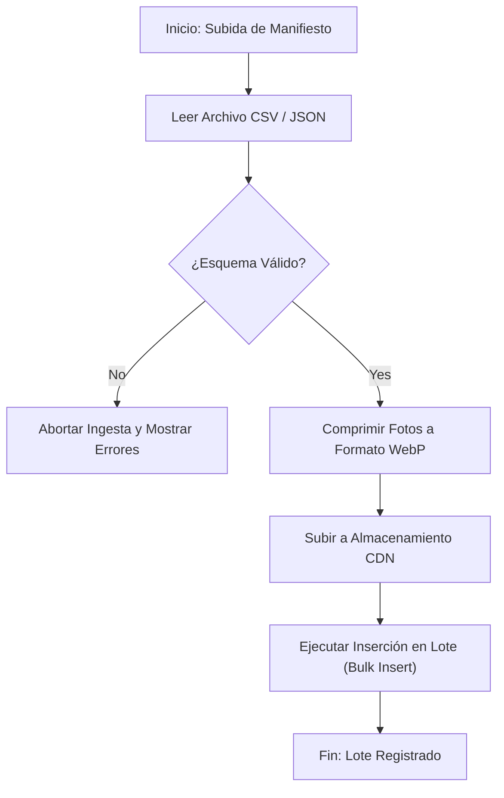

# Especificación de Módulo: MOD-IMP (Ingesta y Carga Masiva por Lotes de Mercancía e Imágenes)

### 1. Metadatos del Documento
- **Proyecto:** Adí (Gestión de Inventario y CRM de Calzado Deportivo)
- **Fase:** 3 — Ingeniería de Requisitos
- **Entregable:** Capa 2 — Especificación de Módulo (2 de 4)
- **Módulo:** `MOD-IMP` (Carga Masiva por Lotes, Pipeline de Fotos WebP y Asignación de SKUs)
- **Estado:** Aprobado / Cierre Provisional

---

### 2. Requisitos Base

#### 2.1 Requisitos Funcionales (FR)
- **[CR-IMP-01]** El sistema debe permitir la carga masiva de inventario mediante la importación de archivos CSV o JSON con manifiestos de mercancía importada.
- **[CR-IMP-02]** El sistema debe procesar paquetes de imágenes de calzado en segundo plano, ejecutando compresión automatizada al formato WebP optimizado.
- **[CR-IMP-03]** El sistema debe asociar automáticamente cada imagen procesada con su correspondiente SKU de proveedor internacional y modelo.
- **[CR-IMP-04]** El sistema debe permitir realizar la inserción por volumen (bulk insert) de 50+ variaciones de calzado en una sola operación transaccional.
- **[CR-IMP-05]** El sistema debe registrar un historial de lotes de ingesta capturando la fecha de importación, número de manifiesto y costo total.

#### 2.2 Requisitos No Funcionales del Módulo (NFR)
- **[NFR-IMP-01] Tiempo de Procesamiento de Ingesta:** Un lote de 50+ pares con sus fotos asociadas debe procesarse e indexarse en < 3 segundos.
- **[NFR-IMP-02] Optimización de Almacenamiento:** La conversión a WebP debe reducir el tamaño de almacenamiento en al menos un 60% sin pérdida apreciable de calidad visual.

---

### 3. Historias de Usuario (User Stories)

| ID | Como [Actor] | Quiero [Acción] | Para [Valor] | Origen FR |
| --- | --- | --- | --- | --- |
| **US-IMP-01** | Operador de Inventario | Cargar un manifiesto en CSV con 100 pares de zapatillas importadas. | Evitar el registro manual individual y ahorrar horas de trabajo. | CR-IMP-01, CR-IMP-04 |
| **US-IMP-02** | Operador de Inventario | Subir una carpeta de fotografías de calzado para que el sistema las comprima a WebP. | Reducir el consumo de almacenamiento en la nube y acelerar el renderizado. | CR-IMP-02 |
| **US-IMP-03** | Administrador | Consultar el historial de lotes importados para verificar costos y fecha de ingreso. | Mantener la trazabilidad financiera del inventario importado. | CR-IMP-05 |

---

### 4. Casos de Uso (Use Cases)

#### UC-IMP-01: Carga Masiva por Lote y Pipeline de Fotos WebP
- **Actor:** Operador de Inventario (`ACT-OPE`).
- **Disparador:** El usuario selecciona "Carga Masiva" en el panel gestor y adjunta el manifiesto CSV y archivo de imágenes.
- **Flujo Principal:**
  1. El usuario selecciona el archivo CSV del manifiesto e ingresa el identificador del Lote.
  2. El frontend envía la petición multipart POST `/api/v1/import/batch`.
  3. `SYS-IMP` valida el esquema del CSV (columnas obligatorias: SKU, Marca, Modelo, Colorway, Talla, Cantidad, Costo).
  4. `SYS-IMP` comprime asíncronamente las imágenes adjuntas al formato WebP.
  5. `SYS-IMP` sube las imágenes comprimidas al almacenamiento CDN y recupera las URLs.
  6. `SYS-IMP` ejecuta una transacción SQL `bulk insert` insertando los nuevos SKUs y actualizando existencias.
  7. El sistema retorna HTTP 200 OK con el resumen de ítems creados y procesados.
- **Flujos de Excepción:**
  - **3a. Formato CSV Inválido:** Si faltan columnas requeridas, se aborta la transacción y se retorna HTTP 400 Bad Request con la lista de filas con error.

---

### 5. Chequeo de Conflictos Intra-Módulo
- **Verificación:** Se garantizó que los identificadores de Lote sean únicos y no sobreescriban lotes anteriores.

---

### 6. Diagrama de Actividad Lógico (Mermaid)

---

### 7. Registro de Cierre de Paso
- **Estado:** Cierre Provisional (Provisional Closure)
- **Módulo:** `MOD-IMP`
