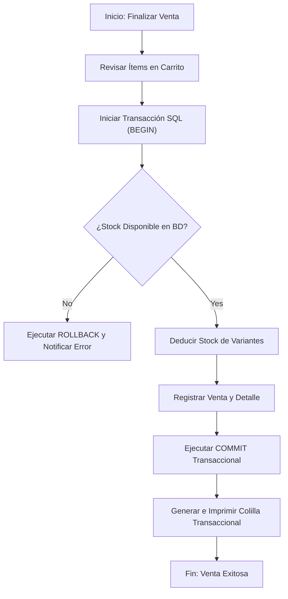

# Especificación de Módulo: MOD-VEN (Punto de Venta y Emisión de Colillas Transaccionales)

### 1. Metadatos del Documento
- **Proyecto:** Adí (Gestión de Inventario y CRM de Calzado Deportivo)
- **Fase:** 3 — Ingeniería de Requisitos
- **Entregable:** Capa 2 — Especificación de Módulo (3 de 4)
- **Módulo:** `MOD-VEN` (Punto de Venta, Registro Transaccional y Emisión de Colillas)
- **Estado:** Aprobado / Cierre Provisional

---

### 2. Requisitos Base

#### 2.1 Requisitos Funcionales (FR)
- **[CR-VEN-01]** El sistema debe proveer una interfaz rápida para buscar productos por modelo, marca, código SKU o código de barras en la caja de venta.
- **[CR-VEN-02]** El sistema debe descontar de manera atómica e instantánea las unidades vendidas del stock disponible en la base de datos.
- **[CR-VEN-03]** El sistema debe generar e imprimir/descargar una **Colilla Transaccional** (comprobante) en PDF o formato de impresión térmica POS.
- **[CR-VEN-04]** La colilla transaccional debe incluir el desglose del producto (Modelo, Talla US/EU/COL, Colorway, Tipo de Par), valor pagado, fecha, número de transacción y código QR/código de barras.
- **[CR-VEN-05]** El sistema debe validar que haya stock suficiente del SKU y tipo de par seleccionado antes de autorizar el cierre de la venta.
- **[CR-VEN-06]** El sistema debe permitir la consulta de transacciones históricas y el procesamiento de cambios o devoluciones previa autorización del Administrador.

#### 2.2 Requisitos No Funcionales del Módulo (NFR)
- **[NFR-VEN-01] Latencia Transaccional:** El procesamiento del registro de venta y actualización de stock debe completarse en < 150 ms.
- **[NFR-VEN-02] Consistencia Atómica (ACID):** Si la generación del comprobante o el guardado transaccional falla, la operación de stock debe revertirse completamente (Rollback).

---

### 3. Historias de Usuario (User Stories)

| ID | Como [Actor] | Quiero [Acción] | Para [Valor] | Origen FR |
| --- | --- | --- | --- | --- |
| **US-VEN-01** | Cajero / Vendedor | Escanear o buscar rápidamente un SKU de calzado durante la venta. | Agilizar la atención al cliente en el mostrador. | CR-VEN-01 |
| **US-VEN-02** | Cajero / Vendedor | Finalizar la transacción y generar automáticamente la colilla impresa. | Entregar al cliente su comprobante físico con garantía. | CR-VEN-03, CR-VEN-04 |
| **US-VEN-03** | Cajero / Vendedor | Recibir un bloqueo si intentó vender una variante sin existencias en bodega. | Evitar sobreventas y descuadres de inventario. | CR-VEN-02, CR-VEN-05 |

---

### 4. Casos de Uso (Use Cases)

#### UC-VEN-01: Procesamiento de Venta y Emisión de Colilla Transaccional
- **Actor:** Cajero / Vendedor (`ACT-VEN`).
- **Disparador:** El vendedor presiona "Finalizar Venta" en el terminal de caja.
- **Flujo Principal:**
  1. El vendedor agrega los ítems seleccionados (SKU, talla, tipo de par) al carrito de venta.
  2. El vendedor selecciona el método de pago (Efectivo / Transferencia) y presiona "Confirmar Venta".
  3. Frontend envía POST `/api/v1/sales/checkout` con el arreglo de ítems.
  4. Backend inicia transacción atómica SQL:
     - Verifica disponibilidad de stock para cada SKU.
     - Resta las cantidades vendidas en la tabla de inventario.
     - Registra la cabecera y detalle de la venta en las tablas transaccionales.
  5. Backend genera la estructura de la **Colilla Transaccional** con código de barras / QR.
  6. Backend retorna HTTP 200 OK con el objeto de la venta y el payload de la colilla.
  7. El frontend envía el comando de impresión a la impresora térmica POS o abre la vista previa en PDF.
- **Flujos de Excepción:**
  - **4a. Stock Insuficiente:** Si alguna variante no posee unidades suficientes, la transacción SQL ejecuta `ROLLBACK` y se retorna HTTP 409 Conflict ("Stock insuficiente para la variante seleccionada").

---

### 5. Chequeo de Conflictos Intra-Módulo
- **Verificación:** Se verificó que el cálculo de impuestos y subtotales en la colilla concuerde exactamente con el total transaccionado.

---

### 6. Diagrama de Actividad Lógico (Mermaid)

---

### 7. Registro de Cierre de Paso
- **Estado:** Cierre Provisional (Provisional Closure)
- **Módulo:** `MOD-VEN`
