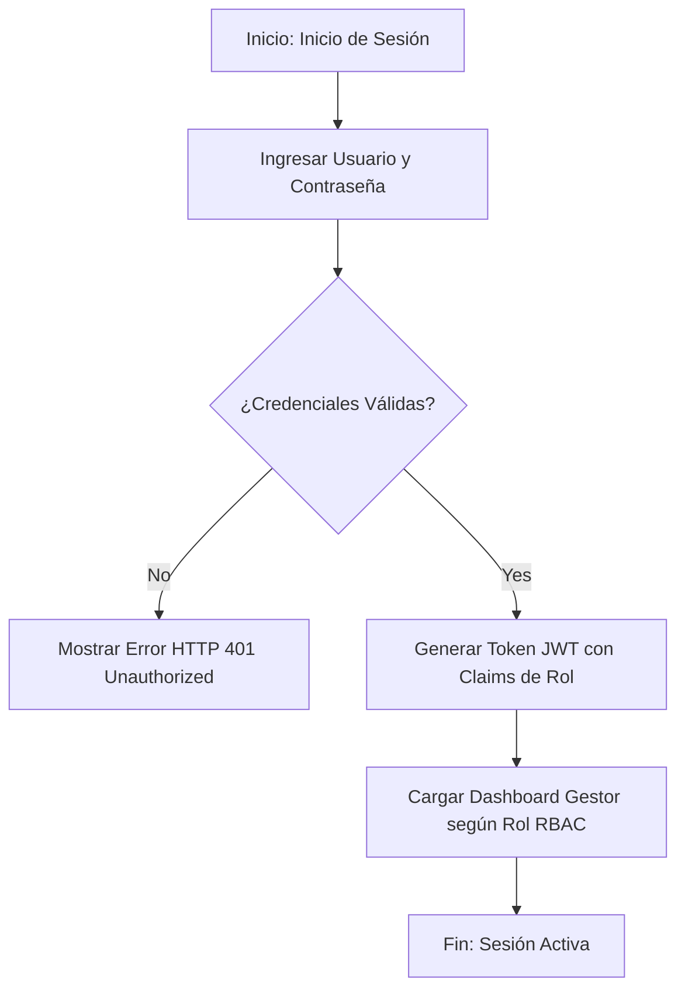

# Especificación de Módulo: MOD-ADM (Panel Administrativo, Usuarios y Configuración RBAC)

### 1. Metadatos del Documento
- **Proyecto:** Adí (Gestión de Inventario y CRM de Calzado Deportivo)
- **Fase:** 3 — Ingeniería de Requisitos
- **Entregable:** Capa 2 — Especificación de Módulo (4 de 4)
- **Módulo:** `MOD-ADM` (Panel de Administración Web, Autenticación JWT, RBAC y Dashboard de Métricas)
- **Estado:** Aprobado / Cierre Provisional

---

### 2. Requisitos Base

#### 2.1 Requisitos Funcionales (FR)
- **[CR-ADM-01]** El sistema debe gestionar la autenticación segura de usuarios mediante tokens JWT y hashing de contraseñas con bcrypt/Argon2.
- **[CR-ADM-02]** El sistema debe implementar un control de acceso basado en roles (RBAC) para los perfiles `ACT-ADM`, `ACT-OPE` y `ACT-VEN`.
- **[CR-ADM-03]** El sistema debe proveer un dashboard principal responsivo con indicadores clave (KPIs): Total de Pares en Bodega, Ventas del Día, Alertas de Stock Mínimo y Lotes Ingestados.
- **[CR-ADM-04]** El sistema debe restringir la visualización de los costos de importación y márgenes de ganancia únicamente al perfil Administrador (`ACT-ADM`).
- **[CR-ADM-05]** El sistema debe mantener un registro de auditoría (Audit Trail) de las acciones críticas realizadas por los usuarios (creación de lotes, ajustes de stock, anulaciones de venta).

#### 2.2 Requisitos No Funcionales del Módulo (NFR)
- **[NFR-ADM-01] Seguridad de Sesión:** Los tokens JWT deben expirar tras 8 horas de inactividad y requerir reautenticación segura.
- **[NFR-ADM-02] Responsividad de la Interfaz:** La interfaz web del panel gestor debe adaptarse dinámicamente a pantallas de escritorio, tabletas y dispositivos móviles.

---

### 3. Historias de Usuario (User Stories)

| ID | Como [Actor] | Quiero [Acción] | Para [Valor] | Origen FR |
| --- | --- | --- | --- | --- |
| **US-ADM-01** | Administrador | Iniciar sesión de forma segura y acceder al dashboard de métricas del negocio. | Monitorear el estado del inventario y las ventas diarias. | CR-ADM-01, CR-ADM-03 |
| **US-ADM-02** | Administrador | Crear cuentas de usuario y asignarles roles específicos (`ACT-OPE`, `ACT-VEN`). | Controlar qué acciones puede realizar cada miembro del equipo. | CR-ADM-02 |
| **US-ADM-03** | Administrador | Revisar el registro de auditoría de modificaciones de inventario. | Supervisar quién realizó ajustes manuales de existencias. | CR-ADM-05 |

---

### 4. Casos de Uso (Use Cases)

#### UC-ADM-01: Autenticación de Usuario y Carga de Dashboard RBAC
- **Actor:** Usuario del Sistema (`ACT-ADM`, `ACT-OPE`, `ACT-VEN`).
- **Disparador:** El usuario ingresa sus credenciales en la pantalla de inicio de sesión.
- **Flujo Principal:**
  1. El usuario ingresa su correo electrónico y contraseña en el formulario de Login.
  2. El frontend envía POST `/api/v1/auth/login`.
  3. Backend verifica la existencia del usuario y compara el hash bcrypt de la contraseña.
  4. Backend genera un token de acceso JWT firmando los claims de rol y permisos.
  5. Backend retorna HTTP 200 OK con el token JWT y el perfil de usuario.
  6. Frontend almacena el token de forma segura e inicializa la vista del dashboard según el rol del usuario.
- **Flujos de Excepción:**
  - **3a. Credenciales Inválidas:** Si el usuario no existe o el hash no coincide, el sistema retorna HTTP 401 Unauthorized ("Credenciales incorrectas").

---

### 5. Chequeo de Conflictos Intra-Módulo
- **Verificación:** Se verificó que las rutas de API del backend estén protegidas por el middleware JWT evaluando los roles del token.

---

### 6. Diagrama de Actividad Lógico (Mermaid)

---

### 7. Registro de Cierre de Paso
- **Estado:** Cierre Provisional (Provisional Closure)
- **Módulo:** `MOD-ADM`
