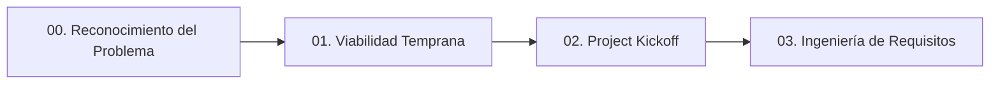

# Proyecto Adí — Documentación General

Bienvenido a la documentación central del **Proyecto Adí**. Este sitio consolida los análisis, entregables y especificaciones técnicas organizados por fases de desarrollo.

---

## Estructura de la Documentación



### Secciones Principales

1. **00. Reconocimiento del Problema**
   - Declaración del problema, evidencias, análisis de soluciones existentes, matriz de impacto, objetivos, mapa de interesados y brief ejecutivo.

2. **01. Viabilidad Temprana**
   - Perfil de usuario, validación de mercado, análisis competitivo, factibilidad técnica, aspectos legales, definición del MVP, Lean Canvas, OKRs y resumen ejecutivo de la Fase 1.

3. **02. Project Kickoff**
   - Identidad del proyecto, restricciones no funcionales, decisión de stack tecnológico, estructura de repositorio, branching strategy, estándares de codificación, estrategia de pruebas y resumen ejecutivo de la Fase 2.

4. **03. Ingeniería de Requisitos**
   - Brief ejecutivo, diagrama de contexto del sistema, definición de actores RBAC, glosario de dominio, registros de elicitación, descomposición de módulos funcionales (`MOD-CAT`, `MOD-IMP`, `MOD-VEN`, `MOD-ADM`), NFRs globales, especificaciones de módulo y SRS e integración del sistema.


---

## Ejecución Local

Para visualizar esta documentación localmente mediante MkDocs:

```bash
# Iniciar el servidor local de desarrollo
mkdocs serve
```

La documentación estará disponible en `http://127.0.0.1:8000`.
